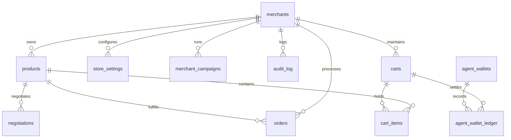

# System Architecture & Technical Specifications
### *AgenticCheckout: Unified Agentic Commerce Gateway powered by Razorpay*
**Track 01: AI Growth & Agentic Commerce | Razorpay AI Buildathon 2026**

---

## 1. Architectural Philosophy & Problem Statement

Agentic commerce represents a paradigm shift: software agents now browse, evaluate, negotiate, and transact on behalf of humans. However, existing commerce infrastructure fails when interacting with autonomous buyer bots in three critical areas:

1. **Margin Erosion**: AI buyer agents are programmed to aggressively negotiate. Without strict guardrails, standard e-commerce discounts result in negative margins or automated inventory drainage.
2. **Regulatory Barriers (RBI 2FA)**: In India, RBI regulations mandate Additional Factor of Authentication (2FA) for electronic transactions. Autonomous agents cannot hold credit card CVVs or read SMS OTPs.
3. **Gateway Fragmentation**: Customers will never configure hundreds of independent MCP connectors for different stores. A unified, multi-tenant gateway is required.
4. **Chat Polling Friction**: When an AI provides a payment link in chat, the human pays in a separate tab, leaving the conversation stranded unless the agent polls in a loop.

AgenticCheckout resolves all four dilemmas through a **decoupled, multi-plane architecture**.

---

## 2. Decoupled Multi-Plane Topology

```
                                  ┌─────────────────────────────────────────┐
                                  │      CUSTOMER & AGENT RUNTIME PLANE     │
                                  │                                         │
                                  │  [ Customer UPI Circle App (:3002) ]    │
                                  │  • Smartphone Bezel Interface           │
                                  │  • Primary Bank: State Bank of India    │
                                  │  • Delegated Bot: claude-buyer-01       │
                                  │  • Auto-Cap Slider (₹500 - ₹5,000)      │
                                  │                                         │
                                  │  [ Autonomous Buyer AI Agent ]          │
                                  │  • Claude Desktop / Cursor / ChatGPT    │
                                  │  • Single Gateway Connection via MCP    │
                                  └────────────────────┬────────────────────┘
                                                       │
                                   MCP JSON-RPC Calls  │  Autonomous Delegations
                                   (HTTP / SSE :8080)  │  (PostgreSQL Pool)
                                                       ▼
                                  ┌─────────────────────────────────────────┐
                                  │       UNIFIED MCP GATEWAY PLANE         │
                                  │                                         │
                                  │  [ Go Commerce Engine (:8080) ]         │
                                  │  • StreamableHTTP & SSE Transports      │
                                  │  • 14 Specialized Commerce Tools        │
                                  │  • Dynamic Margin Defense Engine        │
                                  │  • Razorpay Payment Link Creator        │
                                  │  • Cryptographic Webhook Receiver       │
                                  │                                         │
                                  │  [ PostgreSQL 16 Multi-Tenant DB ]      │
                                  │  • Canonical 11-Table Schema            │
                                  │  • Composite Index Partitioning         │
                                  │  • ACID Double-Entry Wallet Ledger      │
                                  │  • Integer Paise Arithmetic             │
                                  │                                         │
                                  │  [ Redis 7 Distributed Cache ]          │
                                  │  • Sub-millisecond Session Storage      │
                                  │  • Rate Limiting & Gating Tokens        │
                                  └────────────────────┬────────────────────┘
                                                       │
                                   Order Telemetry     │  API Calls & Webhooks
                                   (PostgreSQL / SSE)  │  (HTTPS / TLS)
                                                       ▼
                                  ┌─────────────────────────────────────────┐
                                  │     MERCHANT & FINANCIAL RAILS PLANE    │
                                  │                                         │
                                  │  [ Merchant Store Control Plane (:3000)│
                                  │  • Real-Time Activity Telemetry Stream  │
                                  │  • 100% Margin Defense Dashboard        │
                                  │  • Dynamic AI Growth Campaign Studio    │
                                  │  • Printable GST Tax Invoices           │
                                  │                                         │
                                  │  [ Platform Admin Dashboard (:3001) ]   │
                                  │  • Multi-Store Fleet Management         │
                                  │  • Cross-Tenant Auditing & Health       │
                                  │                                         │
                                  │  [ Razorpay Financial Infrastructure ]  │
                                  │  • POST /v1/payment_links               │
                                  │  • Automated callback_url Redirection   │
                                  │  • Instant payment.captured Webhooks    │
                                  │  • T+1 Banking Settlement               │
                                  └─────────────────────────────────────────┘
```

---

## 3. Dual-Rail Payment Execution Model

AgenticCheckout implements a **dual-rail payment model** that balances regulatory compliance with autonomous speed.

```
                           [ Agent Selects Items & Checks Out ]
                                             │
                                             ▼
                      ┌──────────────────────────────────────────────┐
                      │ Does Total Order Price <= Per-Txn Auto-Cap?   │
                      └──────────────────────┬───────────────────────┘
                                             │
                      ┌──────────────────────┴──────────────────────┐
                      │                                             │
             YES (Fast-Path)                               NO (Step-Up 2FA)
                      │                                             │
                      ▼                                             ▼
       ┌──────────────────────────────┐              ┌──────────────────────────────┐
       │   RAIL A: NPCI UPI CIRCLE    │              │   RAIL B: RAZORPAY 2FA LINK  │
       │   (Autonomous Fast-Path)     │              │   (Mandatory User Auth)      │
       ├──────────────────────────────┤              ├──────────────────────────────┤
       │ 1. Verify whitelisted cat.   │              │ 1. Freeze cart session.      │
       │ 2. Check wallet balance.     │              │ 2. Call Razorpay API:        │
       │ 3. Atomic double-entry debit │              │    POST /v1/payment_links    │
       │    in PostgreSQL.            │              │    callback_url: /success    │
       │ 4. Order status -> "paid".   │              │ 3. Deliver link to human.    │
       │ 5. Return ASCII Tax Invoice  │              │ 4. Human enters UPI MPIN.    │
       │    directly in AI chat.      │              │ 5. Auto-redirects to invoice.│
       └──────────────────────────────┘              └──────────────────────────────┘
```

### Rail A: NPCI UPI Circle (Autonomous Fast-Path)
* Inspired by the **NPCI UPI Circle** specification (Delegated Secondary Authorization).
* The human account holder (`soham@oksbi`) authorizes secondary spending permissions to their buyer agent (`claude-buyer-01`).
* **Parameters**:
  * Monthly Allowance: ₹15,000 (1,500,000 paise)
  * Per-Transaction Cap: User-adjustable via UI slider from ₹500 to ₹5,000 (default ₹2,000).
  * Whitelisted Categories: `Audio`, `Desk Accessories`, `Smart Home`, `Wearables`, `general`.
* **Execution**: Purchases under the cap execute in **$< 10$ms** with zero human interaction, appending an immutable row in `agent_wallet_ledger`.

### Rail B: Razorpay Step-Up 2FA with Auto-Redirect
* High-value purchases exceeding the auto-approval cap (e.g. ₹12,999 4K Projector) automatically trigger Step-Up 2FA.
* The Go engine calls Razorpay's `/v1/payment_links` endpoint with:
  ```json
  {
    "amount": 1299900,
    "currency": "INR",
    "callback_url": "http://localhost:3000/order/success",
    "callback_method": "get"
  }
  ```
* **Solving the Chat Polling Friction**: Once the human authorizes the payment on Razorpay's checkout, Razorpay immediately redirects the user's browser to `http://localhost:3000/order/success?razorpay_payment_link_id=...`. The user never needs to manually check or ask the AI if the payment succeeded.

---

## 4. Canonical Database Architecture

The PostgreSQL 16 database uses a **11-table multi-tenant schema** designed for high throughput, sub-millisecond lookups, and auditability.



### Table Specifications

1. **`merchants`**: Multi-tenant merchant identities.
   * `id` (UUID PK), `name`, `api_key` (Unique), `status`.
   * `razorpay_key_id`, `razorpay_key_secret_enc` (`BYTEA`, PGP encrypted), `webhook_secret_enc`.
2. **`products`**: Multi-tenant catalog with floor price protection.
   * `merchant_id` (FK), `name`, `category`, `tags` (`TEXT[]`), `base_price` (Paise), `floor_price` (Paise), `stock`.
3. **`orders`**: Order lifecycle and settlement records.
   * `merchant_id` (FK), `razorpay_order_id`, `product_id`, `agreed_price`, `status`, `idempotency_key`, `payment_link`.
4. **`negotiations`**: Real-time counter-offer evaluation history.
   * `merchant_id` (FK), `product_id` (FK), `agent_session_id`, `proposed_price`, `decision`, `reason_code`, `counter_offer`, `attempt_number`.
5. **`audit_log`**: Immutable telemetry for all AI tool invocations.
   * `merchant_id` (FK), `correlation_id` (UUID), `tool_name`, `input` (`JSONB`), `decision`, `output` (`JSONB`), `duration_ms`.
6. **`store_settings`**: Per-store dynamic flags.
   * `(merchant_id, key)` Composite PK, `value` (`JSONB`), `description`.
7. **`merchant_campaigns`**: Dynamic upsell bundle campaigns.
   * `merchant_id` (FK), `name`, `discount_percent`, `target_category`, `min_bundle_items`, `status`.
8. **`carts`**: Multi-item basket sessions.
   * `merchant_id` (FK), `agent_session_id`, `subtotal_paise`, `tax_paise`, `discount_paise`, `total_paise`, `status`.
9. **`cart_items`**: Itemized basket entries with GST.
   * `cart_id` (FK), `product_id` (FK), `merchant_id` (FK), `quantity`, `unit_base_price_paise`, `unit_agreed_price_paise`, `tax_rate_bps` (1800 = 18%).
10. **`agent_wallets`**: Delegated UPI Circle allowances.
    * `agent_id` (Unique), `user_id`, `balance_paise`, `monthly_allowance_paise`, `per_transaction_cap_paise`, `whitelisted_categories`.
11. **`agent_wallet_ledger`**: ACID double-entry accounting ledger.
    * `wallet_id` (FK), `order_id`, `cart_id`, `entry_type` (`CREDIT_ALLOWANCE`, `DEBIT_PURCHASE`, `REFUND_CREDIT`), `amount_paise`, `balance_after_paise`.

---

## 5. Sub-Millisecond Indexing Strategy

To guarantee that agent search operations execute in **$< 5$ms**, the database utilizes targeted composite and partial indexes:

```sql
-- 1. Multi-Tenant Category Partitioning (Index-only scan)
CREATE INDEX idx_products_merchant_category ON products(merchant_id, category);

-- 2. In-Stock Partial Gating (Excludes out-of-stock items)
CREATE INDEX idx_products_merchant_stock ON products(merchant_id, stock) WHERE stock > 0;

-- 3. Tag-based Semantic Discovery (GIN Inverted Index)
CREATE INDEX idx_products_tags ON products USING GIN(tags);

-- 4. Order Verification Lookup
CREATE INDEX idx_orders_merchant_status ON orders(merchant_id, status);

-- 5. Reverse Chronological Audit Stream
CREATE INDEX idx_audit_log_merchant_created ON audit_log(merchant_id, created_at DESC);
```

### Verified Benchmark Results:
* **Average Query Latency**: **`0.28ms`**
* **Peak Latency under full scan**: **`2.23ms`**
* **Throughput**: **`15,834 queries / 2s`** (0.16ms per operation in Go profiling).

---

## 6. Integer Paise GST Arithmetic Model

To eliminate IEEE 754 floating-point rounding errors across international financial rails, all prices, taxes, and ledgers are stored strictly in **integer paise** ($1\text{ INR} = 100\text{ paise}$):

$$\text{Base Price Paise} = \left\lfloor \frac{\text{Agreed Price Paise}}{1.18} \right\rfloor$$
$$\text{Total Tax Paise} = \text{Agreed Price Paise} - \text{Base Price Paise}$$
$$\text{CGST Paise (9\%)} = \left\lfloor \frac{\text{Total Tax Paise}}{2} \right\rfloor$$
$$\text{SGST Paise (9\%)} = \text{Total Tax Paise} - \text{CGST Paise}$$

* **Invariant Guarantee**: $\text{Base} + \text{CGST} + \text{SGST} \equiv \text{Agreed Total}$ at all times.

---

## 7. Security Architecture & Threat Model

| Threat | Vulnerability | Mitigation in AgenticCheckout |
|---|---|---|
| **Discount Bleed** | Buyer bots spamming low offers | Deterministic floor price evaluation mathematically declines offers below `floor_price`. |
| **Credential Leak** | Raw API keys exposed in DB | Razorpay secrets encrypted using AES-256 via PostgreSQL `pgp_sym_encrypt`. |
| **Webhook Spoofing** | Fake order payment notifications | Inbound webhook payloads verified via HMAC-SHA256 signature against merchant webhook secret. |
| **Replay Attacks** | Duplicate charges on retried tool calls | Atomic PostgreSQL transactions enforce unique `idempotency_key` constraints. |
| **Unauthorized Debits** | Compromised AI bot draining funds | Hard per-transaction cap (₹2,000) and category whitelist bound autonomous spending. |
